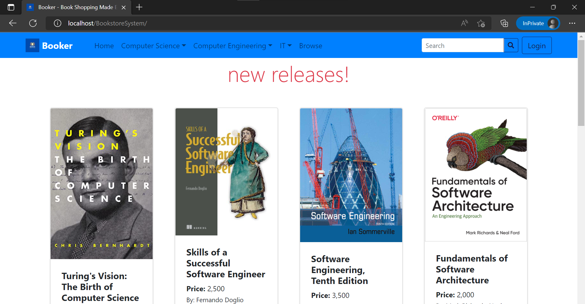

# Booker: A System Making it Easy to Shop Books Online

## CCS0043L: Application Development and Emerging Technologies (Lab), Section TN21, Group Ada (2022)

We present Booker, a web system making it easy to shop books online. For book stores, the group created an e-commerce website in PHP that can be called "Booker - Book Shopping Made Easy". This project offers the client or potential client of the book store access to an online platform where they can browse and order the various book genres that the store/shop sells. Additionally, the system has an admin panel from which the store administration can control the products, orders, and other information in the system.

### Group Ada
Ralph Cajipe*,
🙃 Jeremiah Calig*,
💀 Kyle Español*,
🐋 Leigh Ascaño*,
☄️ Sally Segundo*

**Equal contribution.*

